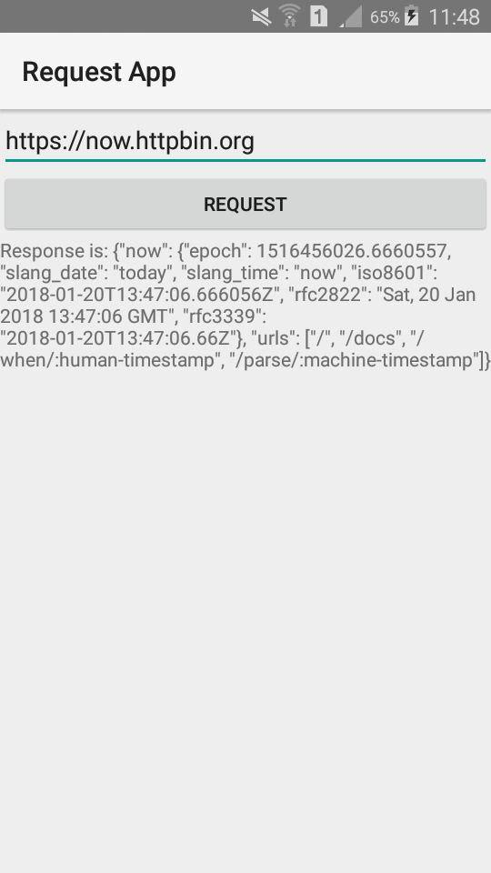

Request App
===========

An app that does requests

## How to run in development

Ensure that you have [Android SDK](https://developer.android.com/studio/index.html#downloads) installed.

Install the Python development requirements:

    pip install -r requirements-dev.txt

[Plug in your Android device](https://developer.android.com/training/basics/firstapp/running-app.html) or [start an emulator](https://developer.android.com/studio/run/emulator-commandline.html).

Build the app:

    python setup.py android

Add this line in AndroidManifest.xml generated
```xml
<uses-permission android:name="android.permission.INTERNET" />
```
Add this lines in build.gradle generate, in the dependencies section:
```xml
repositories {
        jcenter()
    }
    ...
    compile 'com.android.volley:volley:1.1.0'
```

Run the app:
    
    cd android && ./gradlew run


